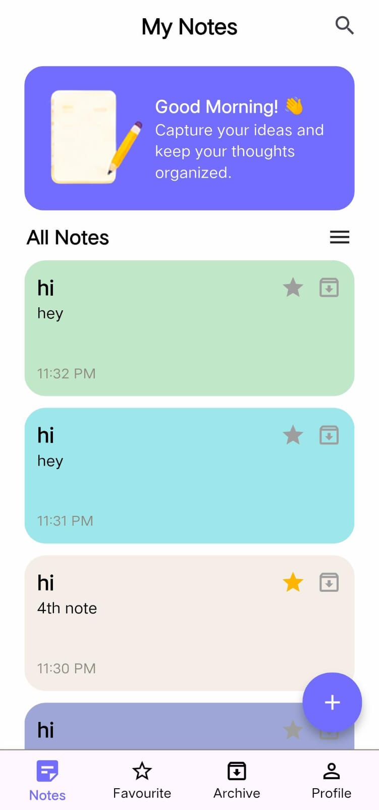
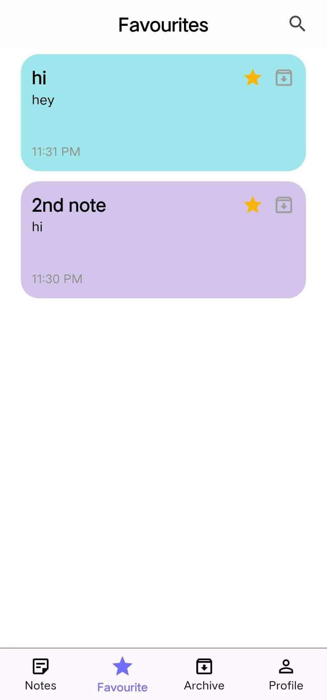
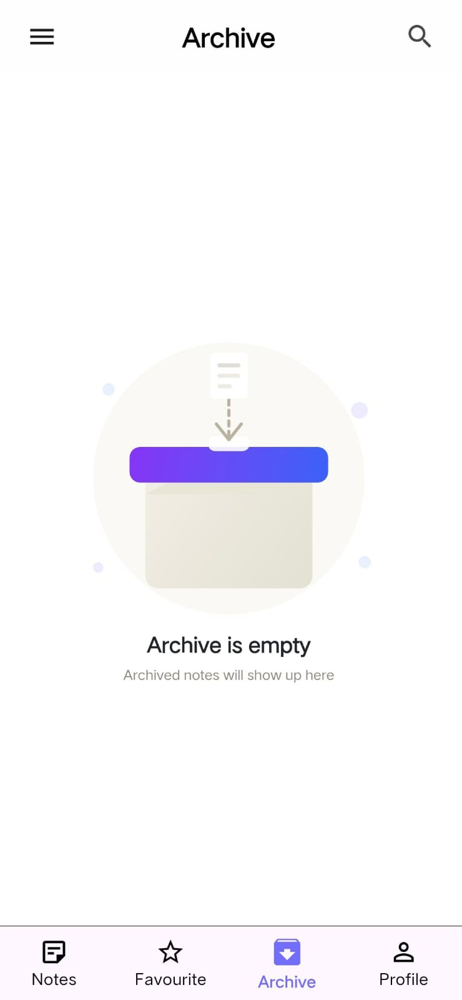
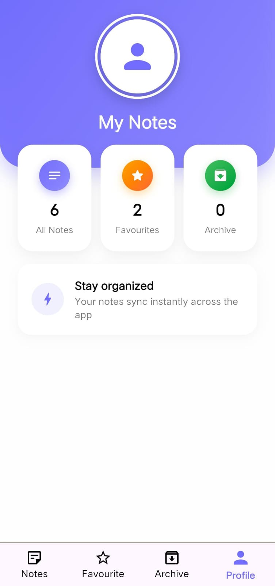

# 📝 Notes App

A simple and clean **Flutter Notes App** built with **Dart & Flutter**, using **GetX** for state management and a structured project architecture.

## ✨ Features

* Create, edit and delete notes
* View saved notes
* GetX state management
* Clean and structured code
* Separate files for UI, logic and models
* Simple and responsive UI

## 🛠️ Technologies

* Flutter
* Dart
* GetX
* Local data storage

## 📱 Screenshots

  
  
  
   
 

## 👨‍💻 Developed With

Built as a Flutter development project to practice **GetX, structured architecture, state management, and clean code organization**.
